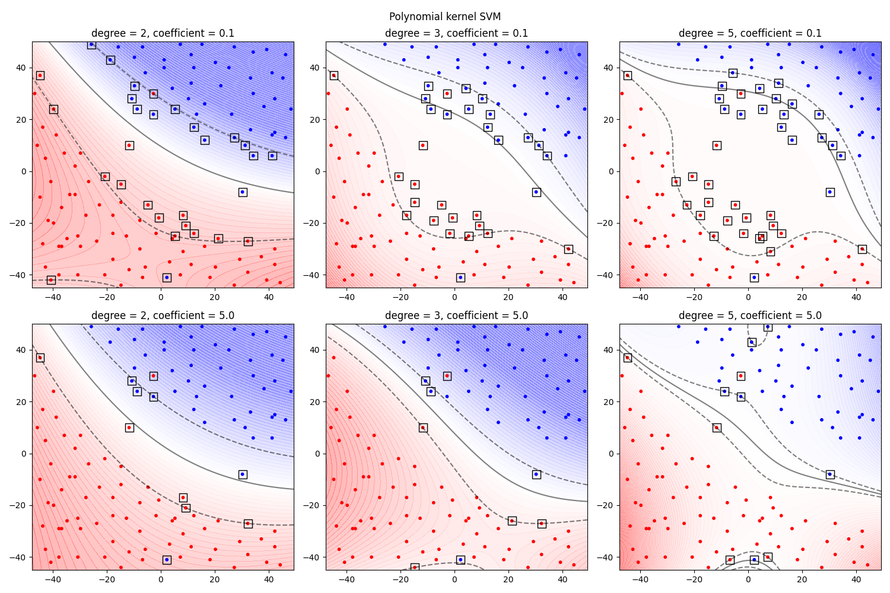

# Experiments with Support Vector Machines
Experiments on 2d datasets with various SVM types.  
The purpose of those experiments is not to find the best classifiers, but to observe how SVMs work.

## Experiments
### Used datasets
I prepared a dataset, that allows for good linear classification, but should work better with nonlinear kernels.   
  

Later on, I will apply each of the following SVMs to the iris dataset, reduced to 2D with PCA.

### Linear SVM
#### Kernel function: K(x, x') = <x, x'>
The classic SVM, that uses dot product to express how simmilar two vectors are.  
C parameter specifies how high the misclassification penalty is - low C values result in a smooth decision boundary at the cost of more of data being on the wrong side.  
Support vectors (data used in calculating the boundary) are denoted by squares.  

### RBF kernel SVM
#### Kernel function: K(x, x') = exp(-gamma*||x-x'||^2)
One of the more popular non-linear kernels. Gamma parameter denotes how far the influence of the datapoint spreads - the higher the value, the closer examples have to be to affect each other.

### Polynomial kernel SVM
#### Kernel function: K(x, x') = (gamma*<x, x'> + coef)^dim
The gamma parameter has the same interpretation as in RBF kernel. (in the experiment the default value is used - 1/(2*dataVariance))

### Custom kernel SVM
#### Kernel function: K(x, x') = (R - ||x - x'||)/R if ||x - x'|| <= R, else 0
We can create custom kernel functions, here is an example.

## Iris dataset
### data covariance matrces

### classifiers applied to iris dataset

